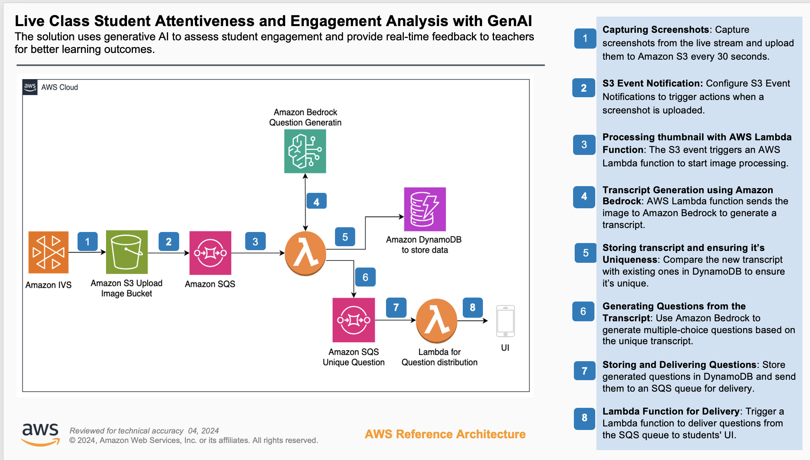

# Student attentiveness and engagement analysis in live classrooms with generative AI

Online learning has revolutionized education, offering broader flexibility and accessibility. However, as many educators have discovered, keeping students engaged in a virtual classroom can be a significant challenge. Students often find it difficult to stay focused with ongoing distractions. Teachers also struggle to gauge attentiveness. As a result, it becomes a pressing need to find innovative ways to keep students actively involved in online live classrooms.

In physical classrooms, teachers use facial cues and student’s expression. By observing these nonverbal signals, teachers can immediately identify whether students are confused, engaged, or losing interest. This helps them manage the classroom in real time, so they know whether to repeat certain concepts or take corrective measures to improve engagement. In online live classrooms, such real-time understanding of students’ understanding and their attentiveness is difficult. Due to network issues,  or students preferring to leave their cameras off, teachers don’t have a good way to understand the classroom’s vibe.

These are the challenges we’re heard from some of our EdTech customers. We’ve built a sample solution teachers can use to gauge students’ attentiveness and their understanding in online live classrooms. Teachers can see this data in real time and can take corrective measures to build engaging classrooms and better learning outcomes.

# Architecture Diagram & Solution Overview

 
The solution relies on shared screen content during online live-classroom instruction. It captures the shared screen at predefined fixed intervals (for example  every that can be configured in 1,2 or 5 minutes). It uses [Amazon Bedrock](https://aws.amazon.com/bedrock/), which provides access to [Generative AI](https://aws.amazon.com/ai/generative-ai/) and [Foundation Models](https://aws.amazon.com/what-is/foundation-model/) to comprehend the visual screen capture and the content. It then uses a generative AI model to generate polls and quizzes that are shared to all students. These real-time interactions from students are captured and showcased to teachers to provide information on how well students are following the topic. Teachers can evaluate attentiveness in real time and identify disengaged students so they can adjust their teaching strategies appropriately.

The solution addresses multiple edge cases that occur during screen capture, such as when the captured view is obstructed, when displayed content doesn't align with the day's lesson topic or core theme, or when the language and medium of instruction are inconsistent with class settings. The sample solution integrates seamlessly with existing live-classroom platforms, making it a flexible and extensible tool for online learning across schools, universities, and other educational institutions.

In this section, we walk you through the steps of this sample solution, which is designed to analyze student engagement and attentiveness in online live classrooms using generative AI. This architecture follows a serverless architecture pattern with an event-driven approach that is built to scale seamlessly with minimal overhead.  

### The solution follows eight event-driven steps:

1.	<u>Capture a screenshot from the online live classroom</u>
2.	<u>Integrate the captured screenshot with asynchronous processing</u>
3.	<u>Process the captured screenshot with an AWS Lambda function</u>
4.	<u>Generate a content description of the captured screenshot using Amazon Bedrock</u>
5.	<u>Store the content description in Amazon DynamoDB</u>
6.	<u>Generate questions for delivering a quiz or poll</u>
7   <u>and 8. Delivering the quiz or poll to the live-classroom solution</u>

#### Capture a screenshot from the online live classroom

This solution uses [Amazon Interactive Video Service (Amazon IVS)](https://aws.amazon.com/ivs/) for streaming and captures screenshots at regular intervals. The sample solution is designed to be flexible and can work with live streaming solutions that allow programmatic screen capture and can store the captures to an [Amazon Simple Storage Service (Amazon S3)](https://aws.amazon.com/s3/) bucket.

With Amazon IVS you can configure the recording with both low latency and real-time options. You can capture a screenshot at any interval between 1 to 300 seconds and store them in your Amazon S3 bucket. This demo solution has been configured to capture a screenshot every 30 seconds. The demo solution also configures the [Amazon S3 Lifecycle](https://docs.aws.amazon.com/AmazonS3/latest/userguide/object-lifecycle-mgmt.html/) rule to remove all screenshots after 1 day.

Alternatively, [Amazon Web Services (AWS)](https://aws.amazon.com/) has another open source solution named [Amazon IVS UGC platform](https://github.com/aws-samples/amazon-ivs-ugc-platform-web-demo/)— It’s a reference application that allows live streaming, user authentication, live chat, and more. You can integrate this sample solution with a user-generated content (UGC) platform application. Refer to [GitHub README.md](https://github.com/aws-samples/amazon-ivs-ugc-platform-web-demo?tab=readme-ov-file#deployment/) for more details and the installation guide.

#### Integrate the captured screenshot with asynchronous processing

After the captured screenshot is stored inside the Amazon S3 bucket, we use Amazon [Amazon Amazon S3 Event Notifications](https://docs.aws.amazon.com/AmazonS3/latest/userguide/EventNotifications.html/) to send notifications for all captured screenshots uploaded to the Amazon S3 bucket. This event triggers the next steps of the workflow- processing the screenshot and generating the corresponding transcript and quiz or poll. Every time a captured screenshot is uploaded to Amazon S3, it triggers an event notification, which stores messages in [Amazon Simple Queue Service (Amazon SQS)](https://aws.amazon.com/sqs/) for asynchronous event-driven processing. These events are asynchronously by an AWS Lambda function.

#### Process the captured screenshot with an AWS Lambda function

The Amazon SQS messages get consumed by AWS Lambda function that handles the entire image processing workflow. It understands what has been presented as part of the captured screenshot, validates whether the extracted content from the captured screenshot is relevant to the topic being taught, and validates whether the content is complete and can be used to generate a quiz or poll.

#### Generate a content description of the captured screenshot using Amazon Bedrock

AWS Lambda function will use [Claude Sonnet 4.0 by Anthropic in Amazon Bedrock](https://aws.amazon.com/bedrock/anthropic/) to infer a textual description from the captured screenshot. You can choose any [large language model (LLM)](https://aws.amazon.com/what-is/large-language-model/) available on Amazon Bedrock that has vision capability. To set proper context and prepare the LLM, we use the following prompt to generate a description of the captured screenshot, which can be content such as text on a presentation slide, or a whiteboard drawing.
 
This prompt is designed for extracting and assessing cloud computing digital-board content only. Before using this prompt, replace *{{expertise}}* with your subject.

Prompt: Role: You are a Teaching & Learning Specialist analyzing screenshots of classroom digital-boards to extract educational content.
What to analyze: Focus exclusively on text/content visible on the digital-board. Ignore teacher/students, chat, or anything not written on the board.
Instructions:
Examine the screenshot of the video class.
Extract all educational text exactly as it appears (questions, answers, steps, explanations, diagram labels).
Translate the extracted content into English while preserving meaning and original formatting.
If the content does not relate to *{{expertise}}*, respond with the single word “irrelevant”.
 
Do: Preserve exact wording, include every visible educational element.
Don’t: Infer, add details, or describe behavior not written on the board.
 
Output: Provide only one of the following:
• Summary including only the extracted board content (translated to English), OR
• The single word “irrelevant”.

#### Store the content description from the captured screen in Amazon DynamoDB
After the content description is generated from the captured screen, it’s important to confirm that the captured screen isn’t a blank or green screen, a welcome or thank you slide, or a slide with content not related to the topic or similar to an already captured description (for example, if you moved back to a previous slide). This helps the solution generate a quiz or poll for only a valid captured screen. These These scenarios validations are being handled inside AWS Lambda function named 'LambdaFunctionForQuesAndTranscript'. After the screen capture is validated, the function stores it inside Amazon DynamoDB.

#### Generate questions for delivering the quiz or poll

After storing the content description, the function now generates a quiz or poll using the stored content description. It uses an Amazon Bedrock LLM to generate the quiz or poll and stores it in Amazon DynamoDB. The following is an example prompt for generating a quiz or poll.
 
Prompt: Role: You are an expert teacher in {{expertise}} designing multiple-choice questions to assess attentiveness and understanding of digital-board content.
When to generate questions: Only when the extracted content clearly relates to *{{expertise}}*.
Requirements for each question:

• English only

• Exactly one question per item

• Exactly four options (A, B, C, D)

• Only one correct answer

• All choices must be relevant, distinct, and plausible

• Include a brief explanation for the correct answer

Ignore any text written on t-shirts, humans, bold formatting. If the transcript already contains a question, use it directly to form the MCQ; if not, create a new question that aligns with the AWS *{{expertise}}* concept reflected in the transcript. Only generate questions when the transcript content is related to AWS *{{expertise}}*.
Each generated question must include four options with one correct answer, ensuring that the options are relevant and logically consistent. Return the output strictly in the following JSON format, and generate questions only in English:
 
{
"question": "<generated question>",
"options": ["<option 1>", "<option 2>", "<option 3>", "<option 4>"],
"solution": "<correct option>",
"result": "True"
}
 
The AWS Lambda function also pushes the generated quiz to the Amazon SQS queue to deliver it to students. This approach allows integration with existing solutions by pulling messages from the queue and delivering them to live-classroom solutions.

#### Delivering the quiz or poll to the live-classroom solution

The AWS Lambda function process the messages from the Amazon SQS queue and sends the generated quiz or poll to the students’ UI. In the sample solution, we’ve integrated logic to deliver questions to the [Amazon IVS UGC platform](https://github.com/aws-samples/amazon-ivs-ugc-platform-web-demo/) demo solution. However, the AWS Lambda function is extensible and can be customized to integrate with any API integration to connect with your live-class streaming solution.

#### How to deploy
This is a sample solution designed to help developers get started with a generative AI integration with an online live -classroom. It isn’t production ready and will require additional development work to be suitable for production use. It is not intended for production use as-is. Its primary goal is to help developers understand the concepts and approach for integration. By using this solution, you understand and accept its risks and limitations. You’re responsible for any charges incurred while creating and launching your solution.
 
We’ve published this solution on GitHub at aws-samples/sample-live-class-student-engagement-analysis-with-generative-ai. The published sample solution has a [detailed guide](https://github.com/aws-samples/sample-live-class-student-engagement-analysis-with-generative-ai/blob/main/docs/DEPLOYMENT_GUIDE.md/) for deployment along with the [prerequisites](https://github.com/aws-samples/sample-live-class-student-engagement-analysis-with-generative-ai/blob/main/docs/PREREQUISITE_GUIDE.md/) needed. 

#### Run the demo:

You can try this demo by uploading a captured screenshot to the Amazon S3 bucket that you provided as ScreenCaptureS3Bucket. This will trigger the complete flow of the architecture, and it calls the final Lambda function LambdaFunctionToRecieveUniqueQuestion’.
 
To run the demo, follow these steps:

1. Navigate to the [Amazon S3 console](https://eu-north-1.signin.aws.amazon.com/oauth?client_id=arn%3Aaws%3Asignin%3A%3A%3Aconsole%2Fs3tb&code_challenge=t0OIDi3_5oMaqLlLCAP-SopM5-rIA4tBpw6OEdYYlX8&code_challenge_method=SHA-256&response_type=code&redirect_uri=https%3A%2F%2Fconsole.aws.amazon.com%2Fs3%2F%3Fca-oauth-flow-id%3D3268%26hashArgs%3D%2523%26isauthcode%3Dtrue%26oauthStart%3D1769953910508%26state%3DhashArgsFromTB_eu-north-1_ba9efffa8f9dcd2d/) and locate the Amazon S3 bucket created using the [AWS Serverless Application Model (AWS SAM)](https://aws.amazon.com/serverless/sam/). You can use the sample_screenshot image located under the asset folder to test. To upload files to the bucket directory, follow the guide at Uploading objects to a directory bucket in the Amazon S3 User Guide. You must create a folder first and then upload the image.

2.	It will trigger the rest of the flow of the architecture and you will be able to see the processing log of the final Lambda function with the name LambdaFunctionToRecieveUniqueQuestion. To access the log of AWS Lambda function, follow the steps at AWS Lambda Developer Guide > [Access function logs using the console](https://docs.aws.amazon.com/lambda/latest/dg/monitoring-cloudwatchlogs-view.html#monitoring-cloudwatchlogs-console).

For more detailed steps, follow this [guide](https://github.com/aws-samples/sample-live-class-student-engagement-analysis-with-generative-ai/blob/main/docs/DEMO_GUIDE.md/).

#### Run the demo with the Amazon IVS UGC platform:
Setting up the Amazon IVS UGC platform demo is optional, but it allows you to explore a fully integrated solution where pop quizzes and questions are displayed to students during the live session, in screenshot like below.
 
Follow these guide fFor the pre-requisites required to set up the demo, make sure the following tools are installed :
 
AWS CLI - [Installing the AWS CLI version 2](https://docs.aws.amazon.com/cli/latest/userguide/getting-started-install.html/)

NodeJS - [Installing Node.js](https://nodejs.org/en/)

Docker - [Installing Docker](https://www.docker.com/get-started/) for Amazon IVS UGC platform demo.
 
To configure and deploy the demo, complete the steps in the following guides:
 
  [Configure the demo](https://github.com/aws-samples/amazon-ivs-ugc-platform-web-demo?tab=readme-ov-file#configuration)

  [Deploy the demo](https://github.com/aws-samples/amazon-ivs-ugc-platform-web-demo?tab=readme-ov-file#deployment/])
 
Follow [Amazon IVS UGC platform integration guide](https://github.com/aws-samples/sample-live-class-student-engagement-analysis-with-generative-ai/blob/main/docs/INTEGRATE_UGC.md/) with sample solution.
 
Follow [Amazon IVS UGC platform demo](https://github.com/aws-samples/sample-live-class-student-engagement-analysis-with-generative-ai/blob/main/docs/DEMO_GUIDE.md/) with sample solution for testing purpose.

### Clean-up steps:

Most of the solution components are serverless, and there will be lower idle cost of the overall architecture. However, to clean up this sample solution, you need to delete the [AWS CloudFormation](https://aws.amazon.com/cloudformation/) template using the following command:

`sam delete`

To clean up the Amazon IVS UGC platform demo:, follow the instructions at [Backend Teardown](https://github.com/aws-samples/amazon-ivs-ugc-platform-web-demo?tab=readme-ov-file#backend-teardown/).

# Conclusion

This solution showcases how generative AI can be used to capture student attentiveness and engagement during online live-classroom instruction. It creates an interactive learning environment that keeps students engaged, giving teachers actionable insights so they can adapt their teaching strategies and ultimately improve learning outcomes. The ability to generate a quiz or poll based on captured screenshots keeps students consistently challenged with relevant content, and the system’s serverless architecture provides seamless scalability on demand with very little overhead.

As online education continues to grow, solutions like these will play a crucial role in integrating virtual learning with traditional classroom experiences. This approach uses an existing solution, and you can engage with AWS partner and your AWS account team to help you customize it for your needs. 

# About the authors

 

Neha Jha is a Solutions Architect. She is a builder who enjoys helping customers accomplish their business needs and solve complex challenges with AWS solutions and best practices. Outside her professional life, Neha enjoys painting, cooking, and dancing.

 

Irshad Chohan is a Principal solutions architect with 18+ years of experience in education, healthcare and other Industry. He collaborates with startups, universities, and government bodies to achieve equitable education, leveraging his passion for simplifying complex systems to scale innovative solutions. Being former edtech CTO himself, he drives now transformative education initiatives across India with AWS.
