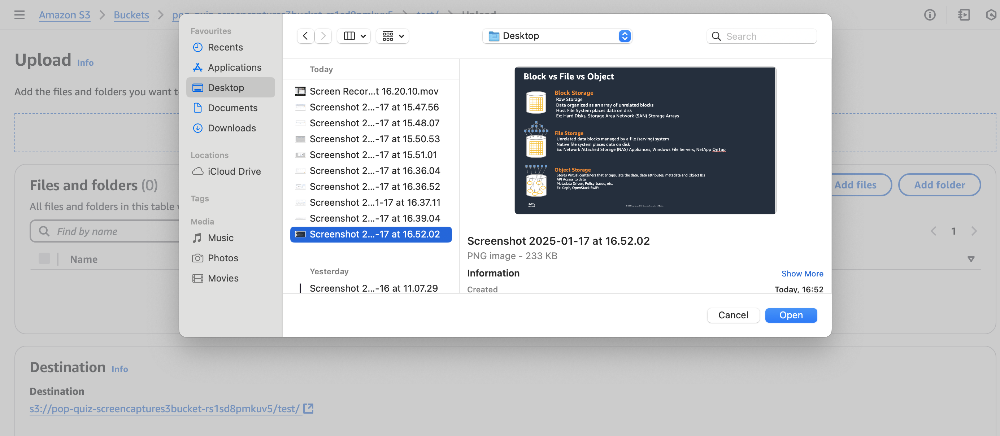
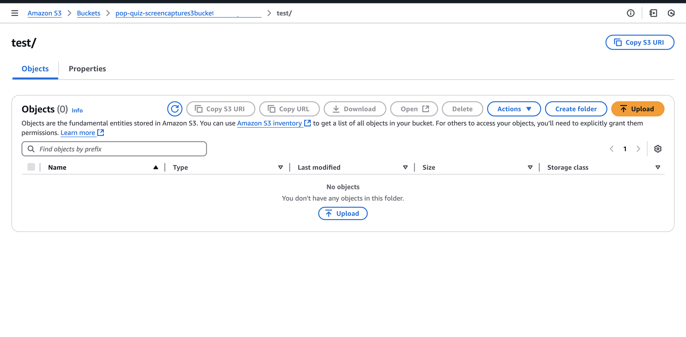
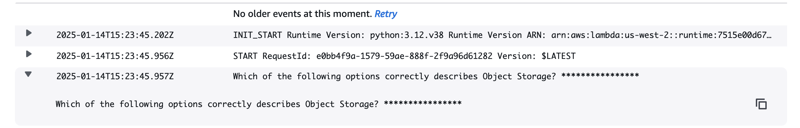

## You can manually test by uploading a jepg sample screenshot inside S3 bucket.

Step 1. Navigate to your S3 console, locate the S3 bucket created with the SAM template. Go to the bucket, create a folder inside it, click on the 'Upload' button, then click 'Add files' and upload an image from the 'classes' folder in GitHub.

Step 2. It will trigger rest of the flow of the architecture and finally you will be able to see the processing log of final AWS Lambda function with name LambdaFunctionToRecieveUniqueQuestion
    
Go to the Lambda function, then navigate to the 'Monitor' tab and click on 'View CloudWatch Logs.' Here, you will find  the generated question.

