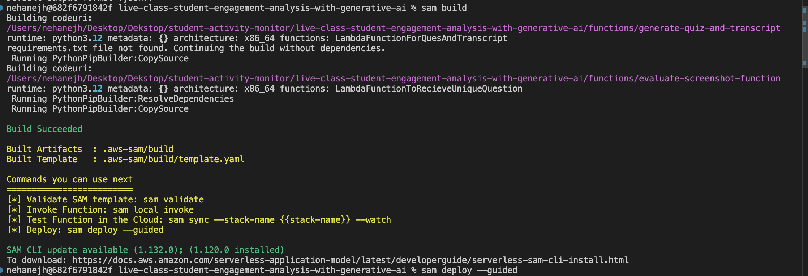
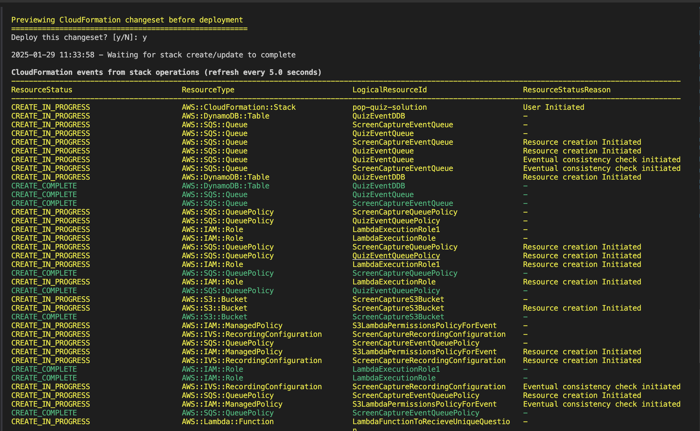
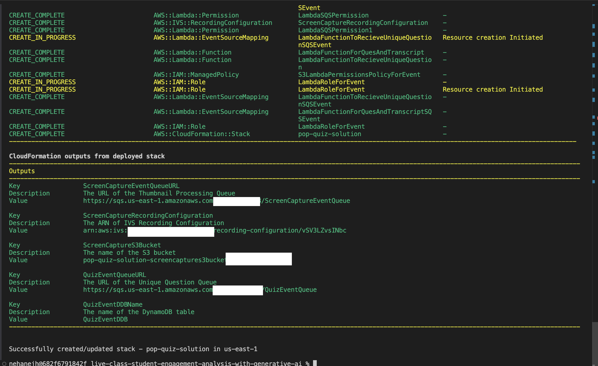

## Now Deploy the SAM template to launch all the resources

Step 1. To obtain all the necessary files locally, run the following command:

`git clone git@ssh.gitlab.aws.dev:wwps-india/ps-prototyping-team/live-class-student-engagement-analysis-with-generative-ai.git`

Alternatively, you can download the provided files directly.

Step-2: Go to the folder "live-class-student-engagement-analysis-with-generative-ai"

   cd live-class-student-engagement-analysis-with-generative-ai

Step-3: Then, run the following commands:

    sam build

This will compile and prepare your Lambda functions and other resources defined in your template for deployment.

Once the build is complete, the output will look like below in the terminal:

    sam deploy

Step-4: It will prompt you for the stack name, AWS Region and S3 bucket name. Provide the stack name and S3 bucket name. For the rest of the parameters, you can either provide a value or leave them blank to accept the default values.

Once the deploy is complete, the output will look like below in the terminal:

Note: Make sure to copy the S3 bucket name once the deployment is complete, as it will be needed for future references.   

Afterwards, go to CloudFormation. Within 1-2 minutes, you’ll see the stack created. From there, you can access any resources by clicking on the physical ID.

