# Update the environment variable of Lambda Function.

Step 1: Navigate to the Configuration tab of the Lambda function named "LambdaFunctionToReceiveUniqueQuestion".

Add the following four environment variables and their respective values:

1. client_id: Set the value to the Cognito client.
2. url_link: Set the value to the apiBaseUrl.
3. username: Set the value to your UGC demo username.
4. password: Set the value to your UGC demo password.

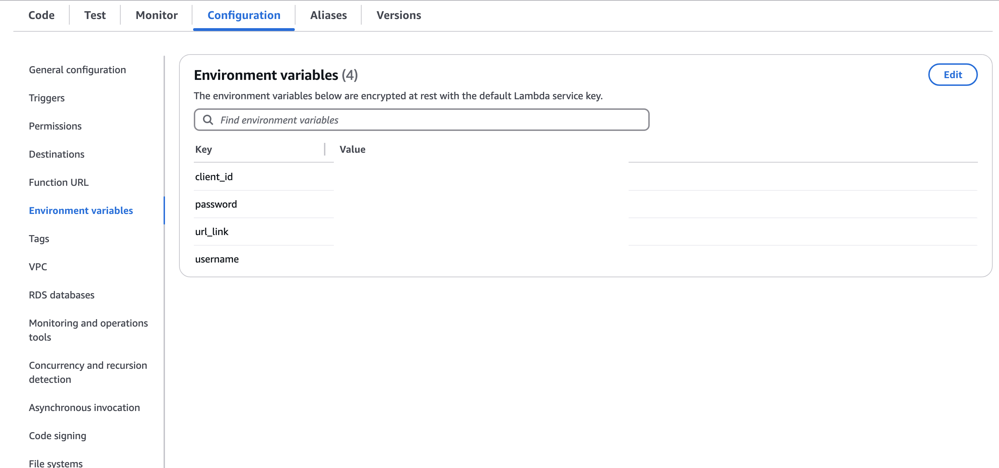

Step-2: To obtain client_id go to the Cognito console, open the user pool associated with your application and click on the your channel under **User Pools**.

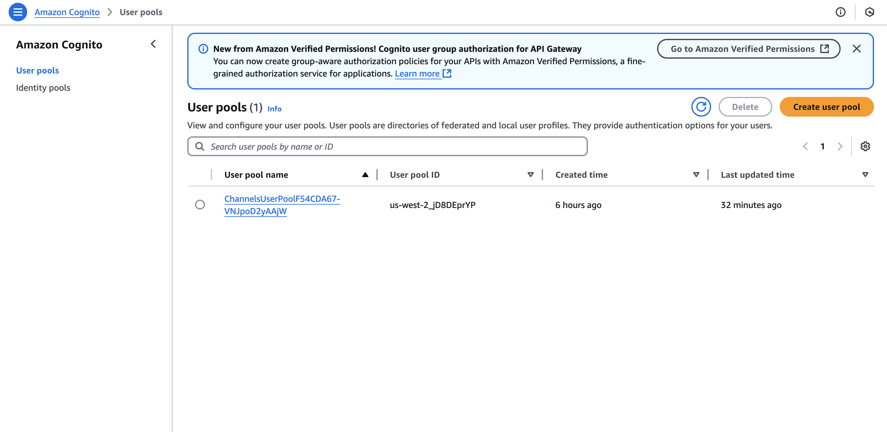

 Step-3: Now from the left pannel, go to **App Client** under "Applications", Click on channel under "App Client Name" and copy Client Id.

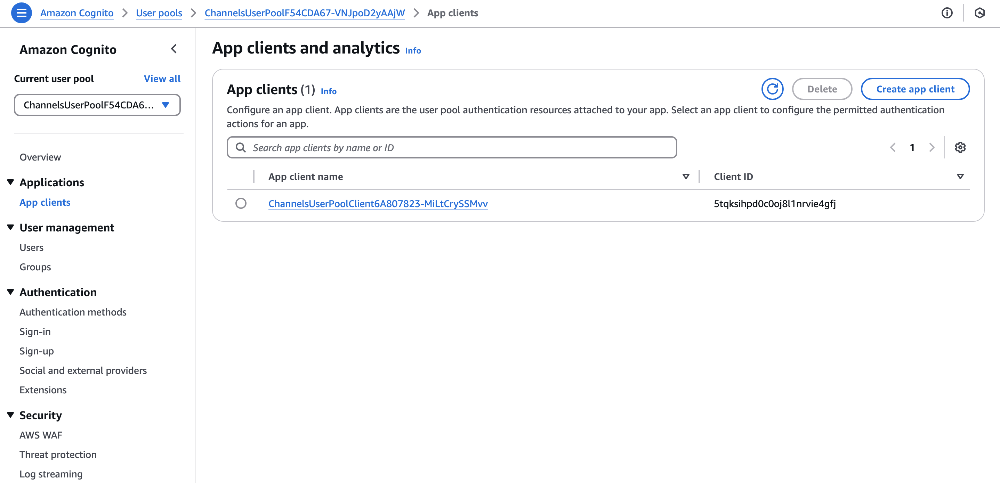

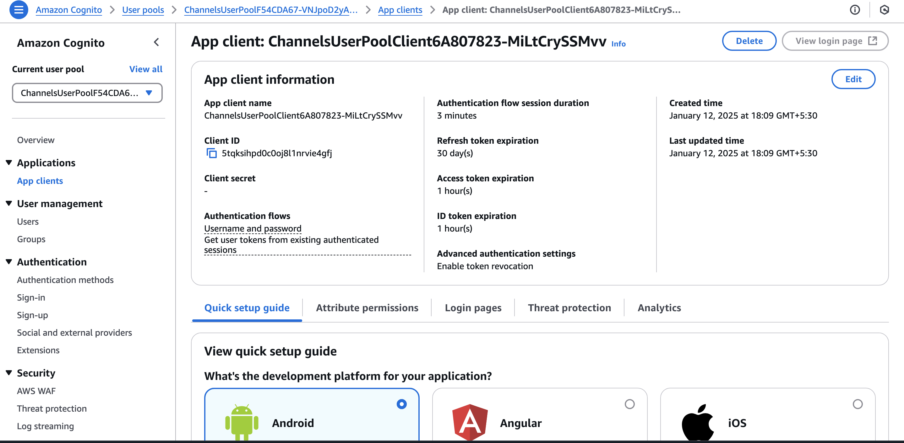

Step-4: Paste the copied client ID and add it as environment variable.

Step-5: Now Update the API URL

Replace the **url_link** value with "apiBaseUrl" in the same file.

-> You can obtain this URL from the CloudFormation stack named UGC dev, found in the output section and append /channel/actions/send at the end.

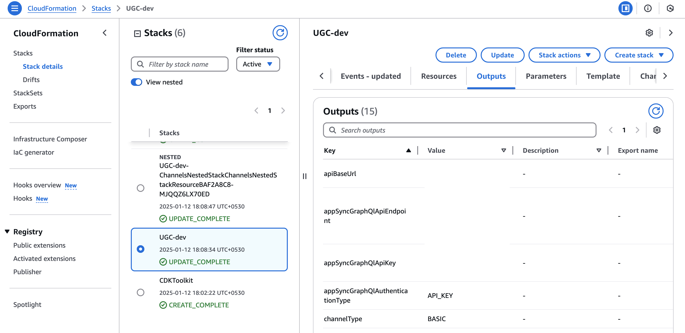

Step-7: Open the configuration file and place the value for username and password fields with your UGC Demo login ID and password.

NOTE: To get UGC Demo login ID and password, you need to open "frontendAppBaseUrl" from the CloudFormation stack named UGC dev, found in the output section. Then you have to create user and you can use that username and password for your environment variabl.

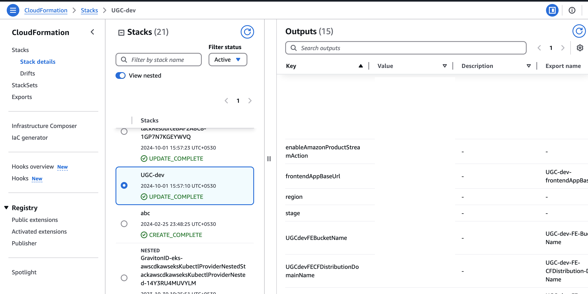

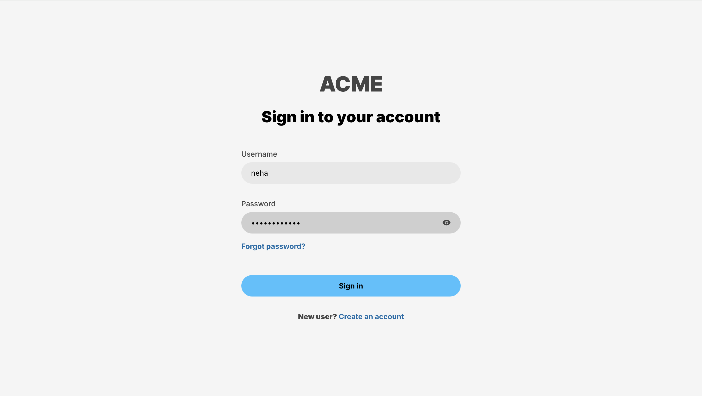

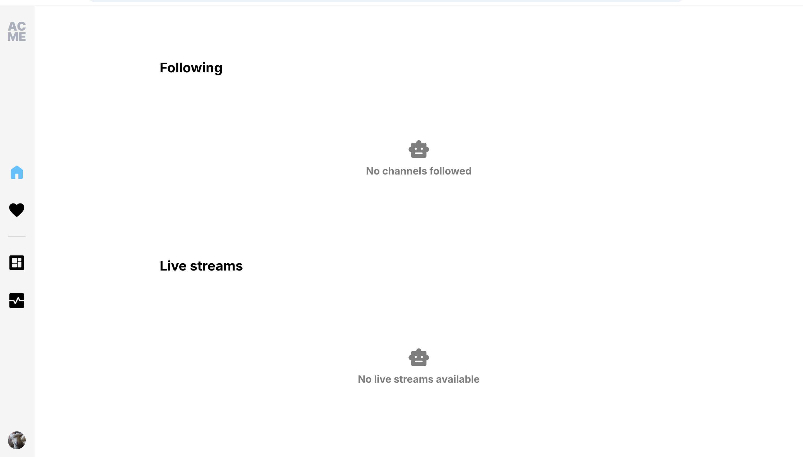

# Now do the following changes in Cognito

Go to the Cognito Console, under user pool, you will find the the created channel.

Open your **Channel**. In the left panel, navigate to **Authentication** and expand it. Click on **Extensions**, where you will find **Lambda Triggers**. From this section, delete all the Lambda Triggers.

# Integration of IVS UGC Demo with the solution to generate Question based upon captured Screenshot.

Step-1. Go to the CloudFormation console and locate the stack named **UGC dev**.

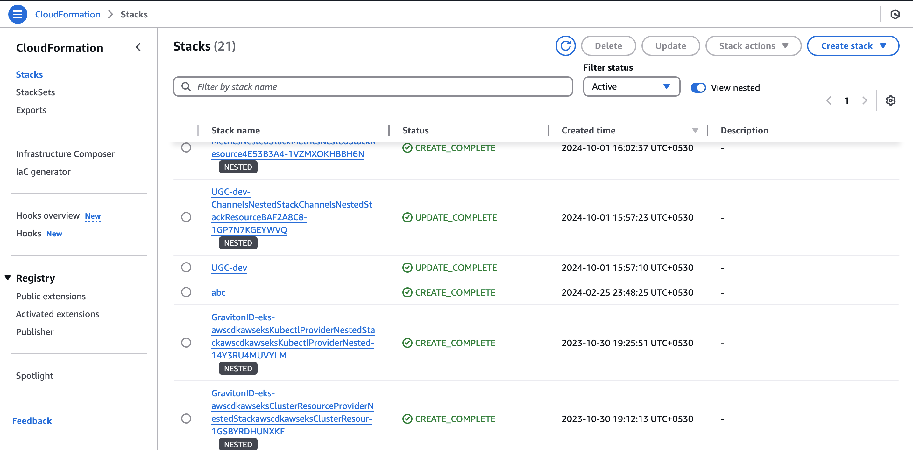

Step-2. Click on the Outputs tab, scroll down, and find the frontendAppBaseUrl. Use this URL to open the login page.

Step-3. Create a user account and login to access the home screen.

Step-4. Now navigate to the **IVS Console**, you will find the channel you created. Next, we need to attach the recording configuration which already get created as part of SAM Templaate resource, to automatically capture screenshots from the live session and send them to the S3 bucket, which is also get deployed as a part of SAM Template resource. 

Step-5. Navigate to IVS console, You will find **Recording Configuration** From the left panel, click on **Recording configuration** and note the name of created Recording Configuration.

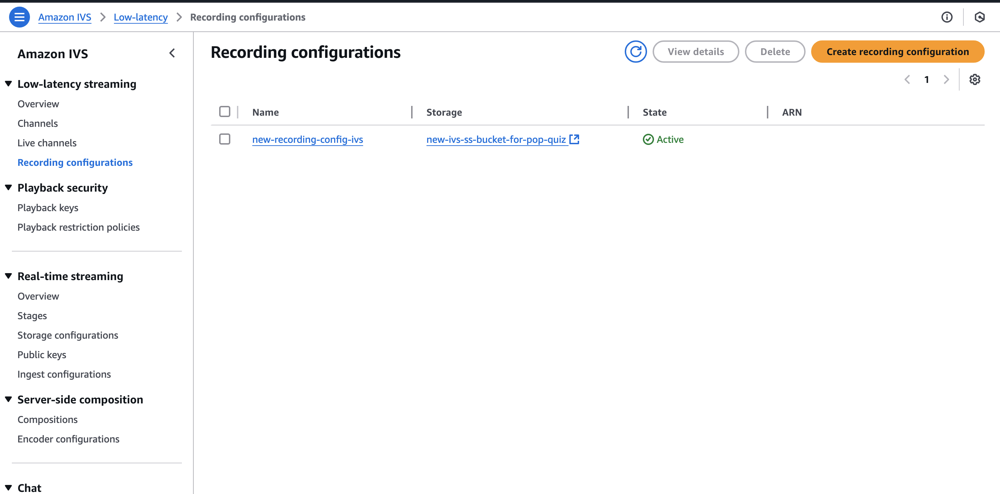

Step-10. Go to the channel, attach the recording configuration, click on **Edit** from the top menu.

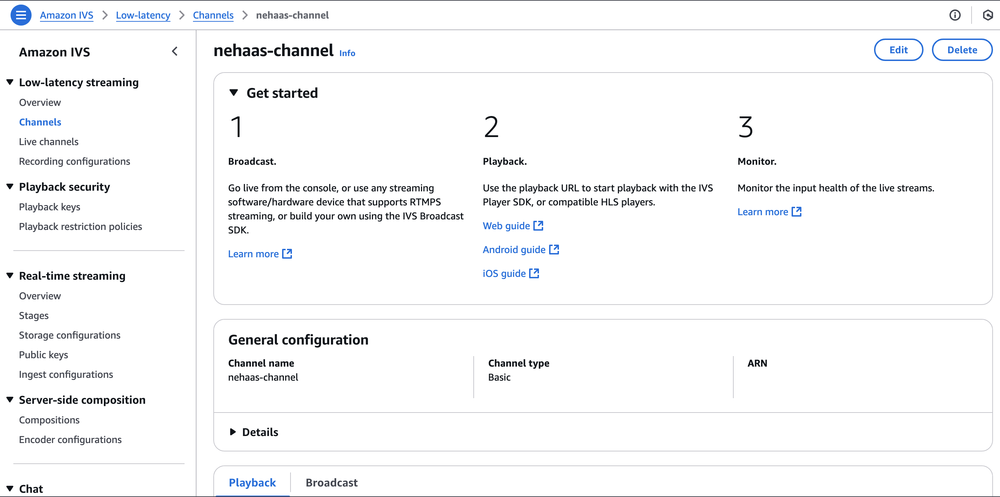

Step-11. **Enable automatic recording** under "Record and store streams" , select the created recording configuration, and click  on **Save Changes**.

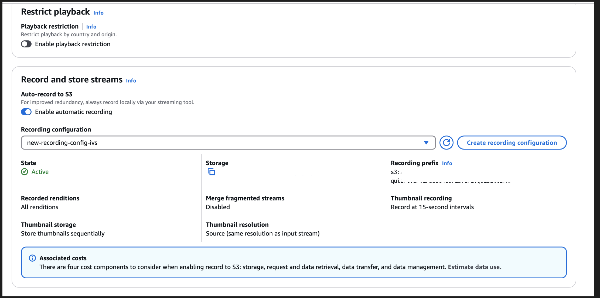
