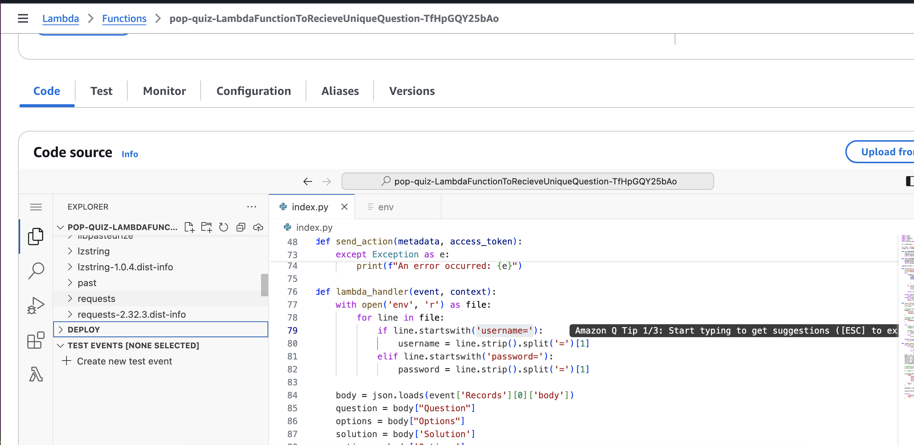
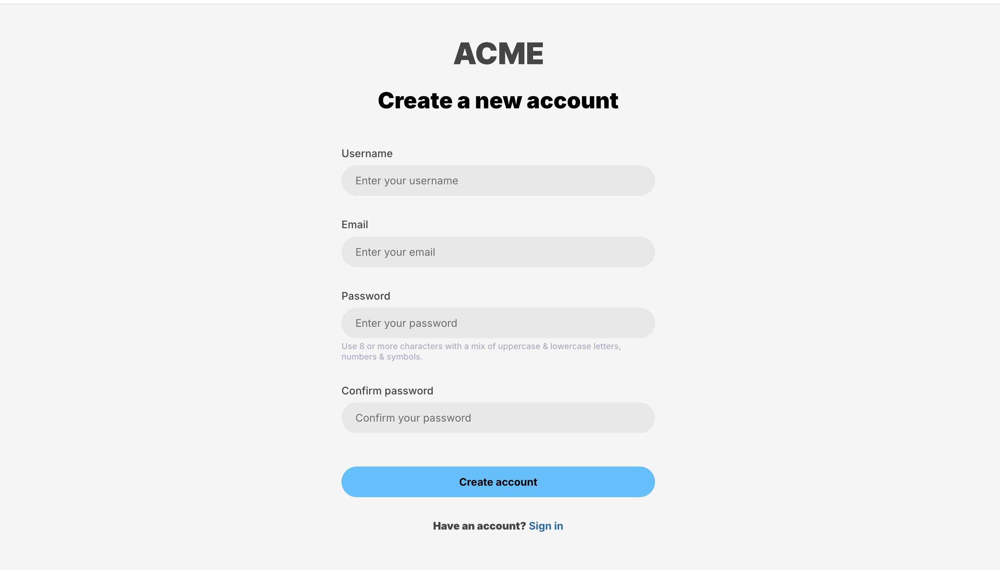
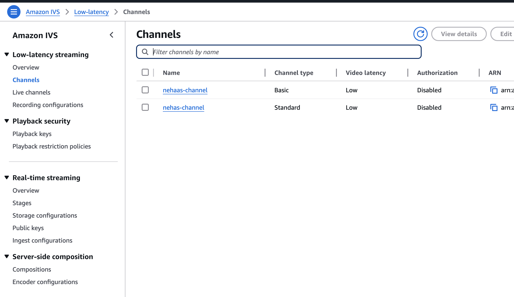

# Update the index.py File

Step-1: Open the index.py file in Lambda function with name "LambdaFunctionToRecieveUniqueQuestion", replace the placeholder for client_id with your Cognito client ID:

Step-2: Go to the Cognito console, open the user pool associated with your application and click on the your channel under **User Pool Name**.

 Step-3: Now from the left pannel, go to **App Client** under "Applications", Click on channel under "App Client Name" and copy Client Id.

Step-4: Paste the copied client ID into your index.py file.

Step-5: Now Update the API URL

Replace the **url_link** dummy value with "appBaseUrl" in the same file.

-> You can obtain this URL after deploying the IVS UGC demo from the CloudFormation stack named UGC dev, found in the output section and append /channel/actions/send at the end.

Step-6: Update the Environment Variables, navigate to AWS Lambda Function with name "LambdaFunctionToRecieveUniqueQuestion". Click on first "+" icon from the left panel to create env file. Create file with name "env" and then add your username and password.

Step-7: Open the .env file and replace the username and password fields with your UGC Demo login ID and password.

NOTE: To get UGC Demo login ID and password, you need to open "frontendAppBaseUrl" from the CloudFormation stack named UGC dev, found in the output section. Then you have to create user and you can use that username and password for your environment variabl.

# Follow these steps to set up the IVS UGC demo(for dev environment).

link: https://github.com/aws-samples/amazon-ivs-ugc-platform-web-demo?tab=readme-ov-file#deployment

# Now do the following changes in Cognito

Go to the Cognito Console, you will find the the created channel, open the channel and go to **User Pool Properties** tab at the end.

From here delete all the Lambda Trigger.

# Integration of IVS UGC Demo with the solution to generate Question based upon captured Screenshot.

Step-1. Go to the CloudFormation console and locate the stack named **UGC dev**.

Step-2. Click on the Outputs tab, scroll down, and find the frontendAppBaseUrl. Use this URL to open the login page.

Step-3. Create a user account and login to access the home screen.

Step-4. Now navigate to the **IVS Console**, you will find the channel you created. Next, we need to attach the recording configuration which already get created as part of SAM Templaate resource, to automatically capture screenshots from the live session and send them to the S3 bucket, which is also get deployed as a part of SAM Template resource.

Step-5. Access **Recording Configuration** From the left panel, select **Recording configuration** then **create recording configuration**.

Step-10. Go to the channel, attach the recording configuration, click on **Edit** from the top menu.

Step-11. **Enable automatic recording**, select the created recording configuration, and click **Save Changes.**

