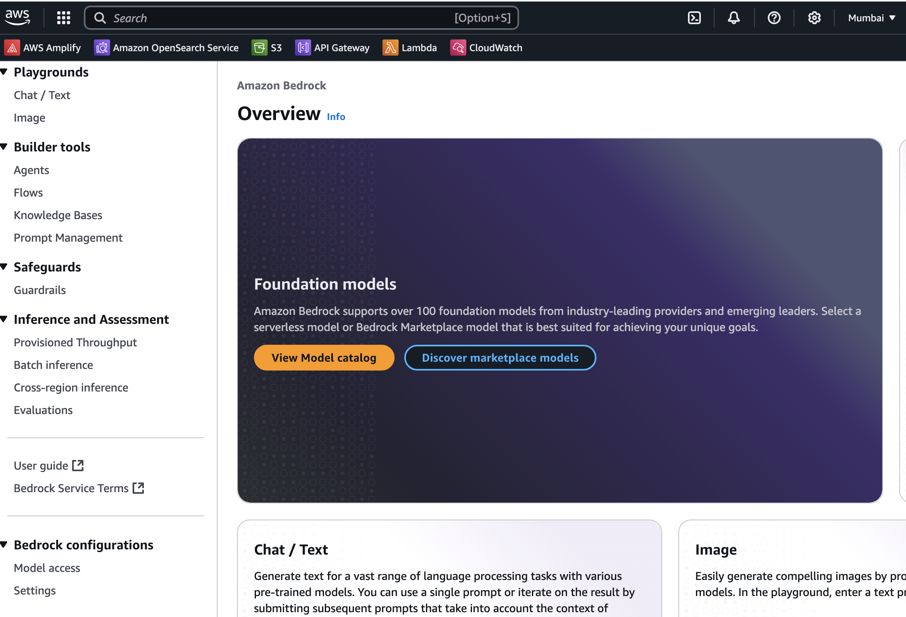
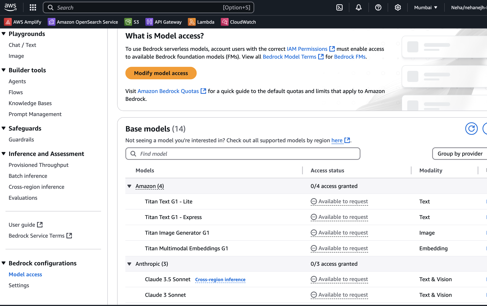
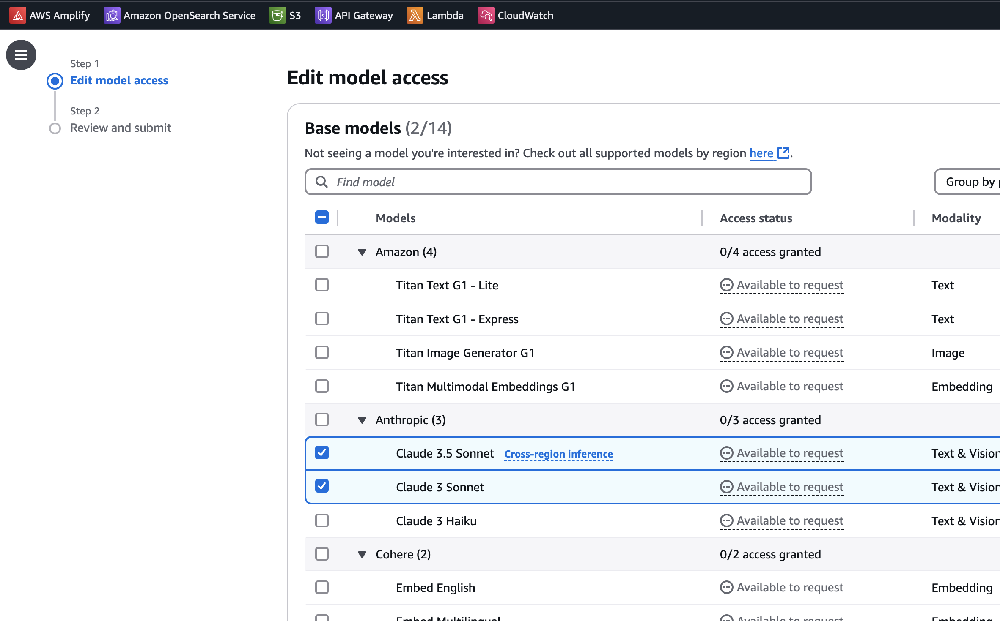
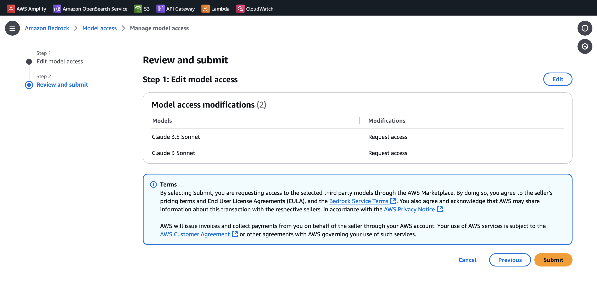

## Prerequisites:

Step 1. An active AWS account.

Step 2. AWS CLI installed and configured : https://docs.aws.amazon.com/cli/latest/userguide/getting-started-install.html

To verify if AWS CLI is installed, run the following command:

  aws --version

Step 3. Install sam cli: https://docs.aws.amazon.com/serverless-application-model/latest/developerguide/install-sam-cli.html

To check if SAM CLI is installed, use the following command:

  sam --version

Step 4. Having AWS profile with AWS account administrative access.

To create an IAM user with administrative access, follow this guide: https://docs.aws.amazon.com/streams/latest/dev/setting-up.html

Once the IAM user is created, generate secret credentials by following this guide: https://docs.aws.amazon.com/cli/v1/userguide/cli-authentication-user.html#cli-authentication-user-create

After obtaining the access key and secret key, use them to configure AWS CLI:

 aws configure

Step 5. Enable Amazon Bedrock Claude 3 Sonet  Model access: https://docs.aws.amazon.com/bedrock/latest/userguide/model-access-modify.html

To verify if you have access to the Claude 3 Sonet model, run the following command:

 aws bedrock list-foundation-models | grep "claude-3-sonnet"

Optionally, you can follow the steps below to enable Amazon Bedrock model access:

a. Navigate to AWS console, search for **Amazon Bedrock**. 

b. Click on **Get Started** and then click on **Request access model** from the bottom of left pannel.

c. Enable Claude 3 sonet Model and click on **Next**.

d. Click on **Submit** button to save the changes.

